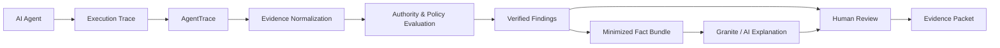

# AgentTrace

## Evidence-Backed Verification for AI Agents

**GitHub repository:** [https://github.com/Nithin-Bhargav-07/AgentTrace](https://github.com/Nithin-Bhargav-07/AgentTrace)

---

## 1. The Problem

AI agents increasingly perform multi-step actions across tools, APIs, files, and external systems. 

After execution, it can be difficult to determine:
- What the agent actually did
- Whether those actions were authorized
- Which evidence supports each action
- Whether an apparent failure was real or contextual
- Whether remediation actually restored the system

Traditional logs show events, but they do not necessarily provide an evidence-backed assessment of whether those actions were within authority.

---

## 2. The Solution

**AgentTrace is a post-run verification and review system for AI-agent execution traces.**

AgentTrace helps teams close the accountability gap by doing the following:
- Ingests an agent execution trace
- Normalizes its events
- Maps actions to declared authority
- Evaluates actions using deterministic policies
- Identifies evidence gaps
- Produces evidence-linked findings
- Provides bounded AI explanations
- Supports human review
- Produces portable evidence

**Important:** The deterministic policy engine establishes the underlying verdict. AI is NOT the component that decides what actually happened.

---

## 3. Why AgentTrace

| Challenge | AgentTrace |
|---|---|
| Raw agent logs are difficult to review | Structured evidence mapping |
| Actions may exceed declared authority | Deterministic authority checks |
| Missing evidence can be mistaken for safety | Explicit evidence-gap handling |
| AI explanations can hallucinate | Evidence-grounded bounded AI layer |
| Remediation may not actually recover a system | Recovery verification |
| Review results can be difficult to share | Portable evidence packet |

---

## 4. Core Workflow

```text
AI Agent
   ↓
Action Trace
   ↓
AgentTrace
   ↓
Evidence Normalization
   ↓
Authority Mapping
   ↓
Deterministic Policy Engine
   ↓
Findings + Evidence Gaps
   ↓
Bounded AI Explanation
   ↓
Human Review
   ↓
Portable Evidence Packet
```

**Brief explanation:** AgentTrace takes raw execution traces from an agent, normalizes them, and deterministically compares them to declared authority limits. Verified findings and evidence gaps are surfaced and then explained by a bounded AI layer. Finally, a human reviews the findings and exports a portable evidence packet for downstream action.

---

## 5. Key Features

- **Trace ingestion:** Supports uploading or pasting JSON execution logs.
- **Generic JSON mapping:** Allows interactive field mapping for unfamiliar JSON structures.
- **OTLP/GenAI trace support:** Natively supports standard trace structures.
- **Exact source-byte preservation:** Retains the unaltered bytes from the original log.
- **SHA-256 integrity hashing:** Cryptographically binds all findings to the exact input.
- **Canonical event normalization:** Maps diverse logs to standard events.
- **Raw-event accounting:** Accounts for every unparsed, metadata, or mapped event.
- **Authority evaluation:** Reconciles actions against manager-defined limits.
- **Deterministic policy decisions:** Establishes verdicts using strict logic, not AI assumptions.
- **Evidence-gap detection:** Identifies when traces lack sufficient material facts.
- **Incident/action summaries:** Translates canonical events into plain language.
- **Systems and data movement analysis:** Analyzes where external interactions occurred.
- **Recovery-plan generation:** Creates safe, proposed steps for reverting or fixing issues.
- **Recovery verification:** Binds proposed recovery steps to the evidence packet.
- **Human disposition:** Leaves the ultimate Accept/Investigate/Reject decision to the reviewer.
- **Portable evidence packets:** Packages a manager decision brief, validated trace, and recovery plan into one file.
- **Offline/deterministic fallback:** Remains usable entirely without AI/network connectivity.
- **Evidence-linked AI explanations:** Explains deterministic findings using only verified facts.

---

## 6. What Makes AgentTrace Different

**Architecture Principle: AI does not decide what happened.**

AgentTrace strictly separates verification from explanation:

1. **Evidence is preserved first.** The exact source bytes are securely hashed.
2. **Events are normalized deterministically.**
3. **Authority and policy checks are deterministic.** A rule engine decides the verdict.
4. **Findings are generated from verified evidence.**
5. **A minimized/redacted fact bundle is then provided to the AI model.**
6. **The AI explains verified findings rather than inventing evidence.**
7. **Humans retain final disposition.** The AI explanation aids the reviewer, but the human decides the outcome.

---

## 7. AI Boundary

AgentTrace can use **IBM Granite** through **watsonx.ai** as a bounded explanation layer. 

Granite receives a minimized/redacted fact bundle derived from deterministic verification results. **It does not determine the underlying verdict.** 

If the live Granite model is unavailable, unreachable, or fails to produce valid citations, the application uses a fully functional **deterministic fallback** to ensure the review remains completely usable.

---

## 8. Example Scenario

An AI agent is authorized to:
- Read customer records
- Create a support ticket

The execution trace shows:
- Customer record read
- Support ticket created
- Attempt to export customer data

AgentTrace compares the observed actions against the declared authority. The unauthorized export is surfaced as an evidence-backed finding. The AI layer explains the finding using only the verified facts, allowing the manager to investigate the breach without having to comb through thousands of lines of raw logs.

---

## 9. Architecture



---

## 10. Technology Stack

- React / Next.js
- TypeScript
- Node.js
- Zod
- IBM Granite
- watsonx.ai
- JSON / OTLP
- Vercel

---

## 11. Running Locally

Requirements: Node.js 24 and npm 11.

```bash
npm ci
npm run dev
```

For verification, use the provided testing suite:

```bash
npm run verify
npm run eval
```

---

## 12. Verification

Current verified state:
- **367 tests passing**
- **Production build passing**
- **Release audit passing**

---

## 13. HackDevengers 2.0

AgentTrace was built for HackDevengers 2.0 to solve the critical and practical real-world problem of trustworthy AI-agent execution. 

As enterprises adopt AI agents, there is a massive gap in verifying what those agents actually do. AgentTrace applies a novel **deterministic + AI architecture** to solve this, ensuring that human-in-the-loop verification is scalable and reliable. 

With extensible trace adapters, policy-driven verification, and potential enterprise applicability, it represents a leap forward in holding autonomous systems accountable.

---

## 14. Future Scope

While AgentTrace currently focuses on post-run reviews, future expansions could include:
- Live agent monitoring
- Additional trace formats
- Policy-as-code
- Enterprise workflow integrations
- Broader agent/tool ecosystems
- Continuous recovery verification
- Richer analytics

*(Note: These are planned directions and not current functionality.)*

---

## 15. Limitations

AgentTrace is a **post-run review aid**.

It is **not**:
- Live interception
- Automatic enforcement
- Legal/compliance certification
- A tamper-proof logging system
- A system for exposing or reconstructing private chain-of-thought

**Note on evidence:** The absence of an observed activity in a supplied trace does not prove that the activity never occurred outside that trace. AgentTrace's verdicts are bounded strictly to the evidence provided.
