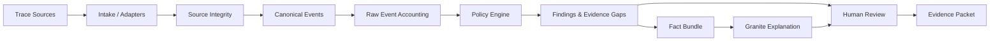

# AgentTrace

## Evidence-Backed Verification for AI Agents

**GitHub repository:** [https://github.com/Nithin-Bhargav-07/AgentTrace](https://github.com/Nithin-Bhargav-07/AgentTrace)

**Judge Guide:** [View the Judge Guide](./docs/JUDGE_GUIDE.md)

AgentTrace verifies what AI agents actually did against what they were authorized to do, using deterministic evidence evaluation and bounded AI explanations.

**Architecture Principle:** AI does not decide what happened. Evidence and deterministic policy evaluation establish the result; AI explains the verified findings.

---

## 1. The Problem

AI agents increasingly perform multi-step actions across:
- APIs
- Databases
- Files
- External services
- Business systems
- Tools

After execution, raw logs can make it difficult to establish:
- What actually happened
- Whether an action was authorized
- Which evidence supports the finding
- Whether missing evidence indicates an evidence gap
- Whether remediation actually restored the system

Ordinary logs show technical events but are insufficient for post-run accountability. They lack authority context, clear verification boundaries, and explicitly modeled evidence gaps.

---

## 2. The Solution

AgentTrace is a post-run verification and review system for AI-agent execution traces.

**Pipeline:**
Trace Intake → Evidence Normalization → Authority Mapping → Deterministic Policy Evaluation → Evidence Gaps → Findings → Bounded AI Explanation → Human Review → Portable Evidence Packet

**Important:** The AI layer does not determine the verdict.

---

## 3. Why AgentTrace

| Challenge | AgentTrace |
|---|---|
| Raw agent logs are difficult to review | Structured evidence mapping |
| Actions may exceed declared authority | Deterministic authority checks |
| Missing evidence can be mistaken for safety | Explicit evidence-gap handling |
| AI explanations can hallucinate | Evidence-grounded bounded AI layer |
| Remediation may not actually recover a system | Recovery verification |
| Review results can be difficult to share | Portable evidence packet |

**Architectural Philosophy:** Verification and explanation are deliberately separated. A deterministic rule engine decides the verdict based on evidence. The AI model only receives a minimized bundle of these verified findings to explain them in plain language.

---

## 4. How AgentTrace Works

### Step 1 — Trace Intake
Accept supported agent execution traces.

### Step 2 — Source Integrity
Preserve the exact source bytes and calculate SHA-256. This ensures cryptographically verifiable lineage from the raw execution log to the final manager decision.

### Step 3 — Event Normalization
Convert source records into canonical events.

### Step 4 — Raw Event Accounting
Account for every event, including events that are:
- Mapped
- Metadata
- Ignored
- Unparsed

This strict accounting ensures an unmapped or unrecognized event is explicitly recorded rather than implied to have disappeared.

### Step 5 — Authority Mapping
Map observed actions against declared authority limits.

### Step 6 — Deterministic Policy Evaluation
Evaluate policy rules using deterministic logic without relying on AI assumptions.

### Step 7 — Evidence Gap Detection
Explicitly distinguish:
*"No evidence was supplied"*
from:
*"The action did not happen."*

### Step 8 — Findings and Incidents
Group evidence into reviewable findings/incidents for the manager.

### Step 9 — Bounded AI Explanation
Create a minimized/redacted fact bundle. The AI receives only verified information, preventing it from hallucinating actions or inventing facts not present in the trace.

### Step 10 — Human Review
A human reviewer can inspect the evidence and record their final disposition.

### Step 11 — Recovery Verification
Recovery recommendations remain non-executing. Post-recovery evidence can be checked separately to verify restoration.

### Step 12 — Portable Evidence Packet
Export a self-contained evidence package for downstream review.

---

## 5. Product Tour

### Trace Intake
Upload or paste execution trace data from compatible sources.

### Generic Mapping
Map unfamiliar JSON fields interactively to the canonical event model.

### Authority Review
Review declared permissions and authority limits assigned to the agent.

### Evidence Gap Mode
Surface missing evidence instead of treating it as proof of safety.

### Policy Checks
Evaluate deterministic policy conditions based on the mapped events.

### Incident Brief
Group important findings into a reviewable summary.

### Recovery Plan
Generate proposed recovery steps without executing them.

### Action Summary
Summarize relevant actions in a digestible format.

### Systems & Data Movement
Show systems interacted with and relevant data movement across boundaries.

### AI Boundary
Show exactly what information is passed to the AI layer, ensuring transparency.

### Evidence Drawer
Inspect source-linked evidence directly tied to the original bytes.

### Human Disposition
Record the reviewer's final disposition (Accept / Investigate / Reject) separately from the deterministic verdict.

### Replay / Verification
Verify the evidence packet and replay the verification process where supported.

---

## 6. Supported Inputs

### Native AgentTrace Trace
Current native trace format.

### OTLP / GenAI
Supported narrow OTLP/GenAI profile.

### Generic JSON
Generic action/event JSON with interactive mapping.

Unsupported formats such as arbitrary YAML, archives, binary bundles, or remote mixed bundles require conversion/adapters before they can be ingested.

---

## 7. Evidence Model

AgentTrace treats evidence as the absolute foundation of the verification process, rather than asking a Large Language Model to loosely interpret raw logs. This model relies on:
- Exact source-byte preservation
- SHA-256 integrity
- Canonical events
- Raw-event accounting
- Source event IDs
- Evidence pointers
- Evidence gaps
- Deterministic findings
- Citation linkage

---

## 8. Deterministic Policy Engine

The Deterministic Policy Engine is responsible for the core decision logic. **The AI model does not determine the verdict.**

Key components include:
- **Authority constraints:** Hard limits on what the agent is permitted to do.
- **Policy checks:** Deterministic rule evaluation against observed events.
- **Deterministic verdict generation:** Strict binary evaluation (Pass/Fail) based on the rules.
- **Finding generation:** Creation of evidence-backed findings.
- **Evidence coverage:** Evaluating whether sufficient evidence exists.
- **Policy decision ledger:** An immutable record of decisions made by the engine.

---

## 9. Recovery Verification

AgentTrace can produce a recovery plan to suggest remediation steps after an unauthorized or failed action, but it **does NOT automatically execute remediation.**

There is an important safety boundary between:
- **Recovery proposed:** Suggestions generated for the human to review.
- **Recovery verified:** Validating that the recovery actions actually took place (via a subsequent trace).

---

## 10. Portable Evidence Packet

The Portable Evidence Packet allows another reviewer or system to inspect the verification result without relying solely on the original UI.

The exported package contains:
- Verified trace
- Evidence metadata
- Findings
- Decision brief
- Recovery plan
- Integrity information
- Verification metadata

---

## 11. AI / Granite Boundary

AgentTrace uses **IBM Granite** through **watsonx.ai** strictly as a bounded explanation layer.

**Architecture:**
Deterministic evidence → minimized/redacted fact bundle → Granite → constrained output → validation → deterministic rendering/fallback

Key boundaries:
- Granite does not decide the verdict.
- Granite does not receive unrestricted raw evidence.
- Citations/findings are strictly validated against the fact bundle.
- A deterministic fallback exists to ensure usability if the AI is unavailable.
- Unsupported claims generated by the AI are rejected.

---

## 12. Architecture


*(Includes recovery verification paths integrated into Human Review and Evidence Packet outputs).*

---

## 13. Example Scenario

An AI agent is authorized to:
- Read customer records
- Create a support ticket

Observed execution trace:
- Read customer record
- Create support ticket
- Attempt to export customer data

AgentTrace identifies the authority deviation using deterministic evaluation. The deterministic engine raises the unauthorized export as a finding. The AI layer is then passed the verified finding and explains the deviation in plain text, without becoming the source of truth for the verdict itself. *(Illustrative scenario).*

---

## 14. Key Technical Principles

- **Deterministic before generative:** Verdicts are calculated by rules, not models.
- **Evidence before explanation:** Facts are established before they are summarized.
- **Explicit evidence gaps:** Absence of evidence is a finding, not an assumption of safety.
- **Human disposition separate from verdict:** The human has the final say.
- **Recovery is proposed, not automatically executed:** Remediation remains air-gapped.
- **Offline/deterministic fallback:** Core verification functions without an internet connection.

---

## 15. Technology Stack

- Next.js / React
- TypeScript
- Node.js
- Zod
- IBM Granite
- watsonx.ai
- JSON
- OTLP
- Vercel

---

## 16. Project Structure

```text
src/
  adapters/       # Ingestion adapters for various trace formats
  ai/             # AI boundary, bounded Granite prompt generation and parsing
  components/     # UI React components
  core/           # Core deterministic logic, policy engine, and integrity
  evaluation/     # Testing and evaluation logic
  fixtures/       # Golden examples and test payloads
  ui/             # App routing and page construction

tests/            # Comprehensive unit and integration test suite
examples/         # Example traces and generated packets
docs/             # Technical guides and recovery planning
```

---

## 17. Local Development

Requirements: Node.js 24 and npm 11.

Install dependencies and run the local development server:
```bash
npm ci
npm run dev
```

Run the deterministic verification test suite:
```bash
npm run verify
npm run eval
```

---

## 18. Verification

Current local verified state:
- **367 tests passing**
- **Production build passing**
- **Release audit passing**

---

## 19. HackDevengers 2.0

AgentTrace is being submitted to HackDevengers 2.0 as an open-innovation solution for trustworthy AI-agent execution. 

The project combines deterministic policy evaluation, evidence integrity, explicit evidence gaps, bounded AI explanation, human review, and portable verification into one cohesive workflow for AI-agent accountability.

---

## 20. Future Scope

Planned future work:
- Live agent monitoring
- More trace formats
- Policy-as-code
- Enterprise workflow integrations
- Broader agent/tool ecosystems
- Continuous recovery verification
- Richer analytics

---

## 21. Limitations

AgentTrace is designed as a **post-run review aid**.

It is **not**:
- Live interception
- Automatic enforcement
- Legal/compliance certification
- Tamper-proof logging
- A system that exposes private chain-of-thought

**Note:** Conclusions are bounded entirely by the supplied evidence. The absence of an observed activity in a trace does not prove that the activity never occurred outside that trace.
